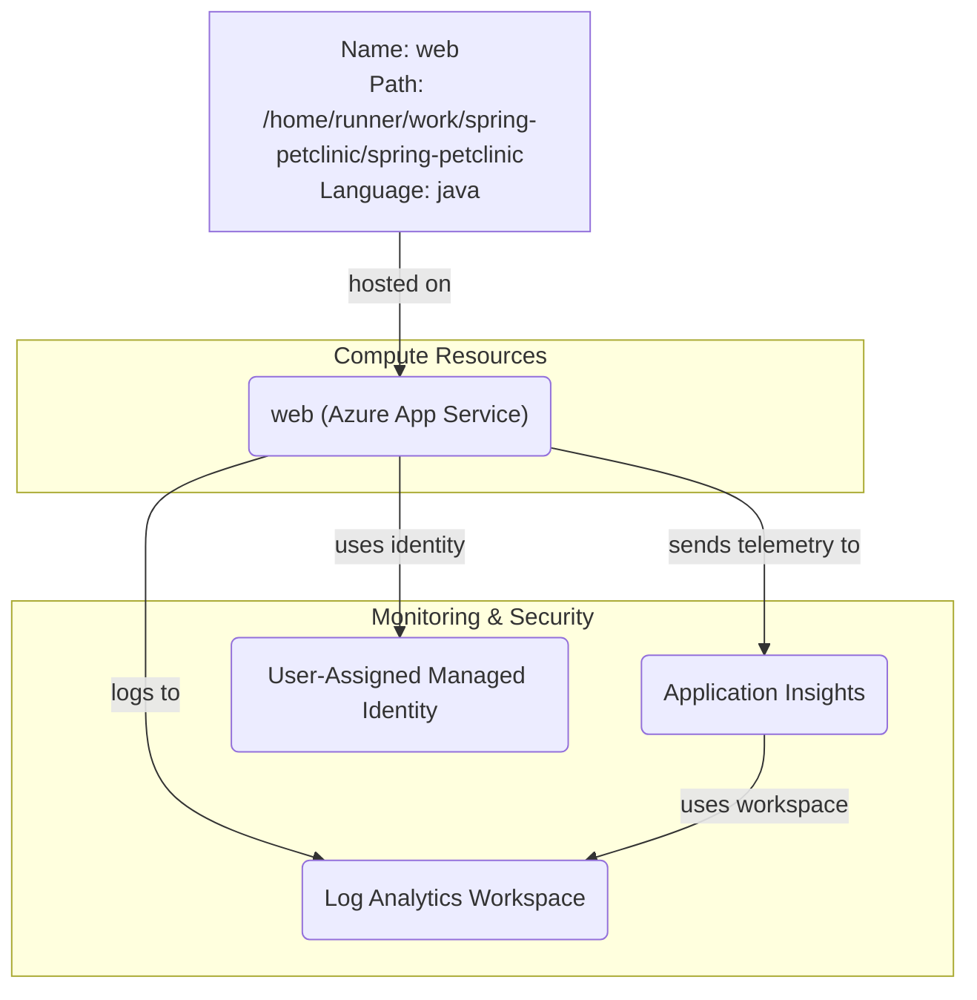

# Azure Deployment Plan for spring-petclinic Project

## **Goal**
Deploy the Spring PetClinic application to Azure using Azure Developer CLI (AZD) with Bicep infrastructure-as-code provisioning.

**Client Info**: {"name":"github-copilot-developer","version":"1.0.0"}

## **Project Information**

**Spring PetClinic**
- **Stack**: Spring Boot 4.0.1 with Java 17
- **Type**: Web application using Spring MVC with Thymeleaf templates
- **Framework**: Spring Boot with JPA, Actuator, Caching
- **Database**: H2 (in-memory) by default, supports MySQL and PostgreSQL
- **Build Tool**: Maven
- **Containerization**: Not present (will be handled by App Service)
- **Dependencies**: None detected (can optionally use MySQL or PostgreSQL)
- **Hosting**: Azure App Service (Java 17)

## **Azure Resources Architecture**

> **Install the mermaid extension in IDE to view the architecture.**

**Resource Relationships**:
- The Spring PetClinic web application is hosted on Azure App Service
- App Service uses User-Assigned Managed Identity for secure Azure resource access
- Application Insights collects telemetry and performance data from the app
- All logs are centralized in Log Analytics Workspace for monitoring and analysis

## **Recommended Azure Resources**

### Application: spring-petclinic (web service)

**Hosting Service**:
- **Type**: Azure App Service (Linux)
- **SKU**: B1 (Basic) - 1 Core, 1.75 GB RAM
  - Suitable for development and testing workloads
  - Supports custom domains and SSL
  - Always-on capability for production scenarios
- **Configuration**:
  - **Runtime**: Java 17
  - **Web Server**: Embedded Tomcat (Spring Boot)
  - **Port**: 8080
  - **Environment Variables**:
    - `SPRING_PROFILES_ACTIVE`: default (h2 database)
    - `JAVA_OPTS`: JVM memory settings

**Dependencies**: None (using H2 in-memory database by default)

## **Recommended Supporting Services**

1. **Application Insights**
   - Purpose: Application performance monitoring and telemetry
   - Connected to: App Service
   - Features: Request tracking, dependency tracking, exception monitoring

2. **User-Assigned Managed Identity**
   - Purpose: Secure authentication to Azure services
   - Assigned to: App Service
   - Permissions: Read access to Application Insights

3. **Log Analytics Workspace**
   - Purpose: Centralized logging and monitoring
   - Connected to: Application Insights, App Service
   - Retention: 30 days (default)

## **Recommended Security Configurations**

1. **Managed Identity Permissions**:
   - User-Assigned Managed Identity must be assigned to App Service
   - Managed Identity has Monitoring Metrics Publisher role for Application Insights

2. **Network Security**:
   - HTTPS-only enforcement enabled on App Service
   - TLS 1.2 minimum version required

3. **Application Security**:
   - System-assigned identity disabled (using user-assigned instead)
   - Remote debugging disabled in production

## **Execution Steps**

> **Below are the steps for Copilot to follow; ask Copilot to update or execute this plan.**

### 1. Create Azure Infrastructure Files for AZD

- [ ] **1.1** Provisioning tool: AZD. Expected files: `azure.yaml`, `infra/main.bicep`, `infra/main.parameters.json`
- [ ] **1.2** Get current subscription ID and call tool `appmod-get-available-region-sku` to get available regions and SKUs for:
  - `Microsoft.Web/sites` (App Service)
  - `Microsoft.Insights/components` (Application Insights)
  - `Microsoft.OperationalInsights/workspaces` (Log Analytics)
  - `Microsoft.ManagedIdentity/userAssignedIdentities` (Managed Identity)
- [ ] **1.3** Check if expected files exist:
  - If files exist: Verify Azure resources match plan requirements, update if needed
  - If files do not exist: Generate missing files
- [ ] **1.4** Generate infrastructure files:
  - Call tool `appmod-get-iac-rules` with parameters:
    - `deploymentTool`: "azd"
    - `iacType`: "bicep"
    - `resourceTypes`: ["appservice"]
  - Generate `azure.yaml` with service configuration
  - Generate `infra/main.bicep` with resource definitions
  - Generate `infra/main.parameters.json` with parameter values
  - Generate `infra/resources.bicep` for resource modules
  - Generate `infra/app/web.bicep` for App Service module
- [ ] **1.5** Validate Bicep files:
  - Run `az bicep build` on all .bicep files
  - Fix any errors and retry
  - Use available error checking tools

### 2. Environment Setup for AZD

- [ ] **2.1** Install AZ CLI and AZD if not installed
- [ ] **2.2** Run `azd env new <envName> --no-prompt` to create a new environment
  - Suggest environment name: "dev" or "prod"
  - If environment exists, verify it matches requirements
- [ ] **2.3** Review infra/main.bicep and infra/main.parameters.json for required environment variables
  - Set environment variables using `azd env set <key> <value>`
  - Use default values from AZ CLI where applicable
- [ ] **2.4** Set the subscription: `azd env set AZURE_SUBSCRIPTION_ID <subscription-id>`
- [ ] **2.5** Set AZURE_LOCATION environment variable with a region from available regions
- [ ] **2.6** Set AZURE_RESOURCE_GROUP environment variable
  - Check if Bicep uses resource group scope
  - If yes, create resource group with: `az group create --name <rg-name> --location <location>`

### 3. Deployment

- [ ] **3.1** Dry run infrastructure provisioning:
  - Run `azd provision --preview --no-prompt`
  - Review the resources to be created
  - Confirm everything is well-formed
- [ ] **3.2** Deploy application:
  - Run `azd up --no-prompt`
  - Monitor deployment progress
  - Iterate on any errors and retry
- [ ] **3.3** Deployment validation:
  - Check application logs to ensure service is running
  - Verify application is accessible via App Service URL
  - Test application endpoints

### 4. Summarize Result

- [ ] **4.1** Use `appmod-summarize-result` tool to summarize deployment
- [ ] **4.2** Generate file: `.azure/summary.copilot.md` with:
  - Deployment status
  - Resource URLs
  - Application endpoint
  - Next steps and recommendations

## **Progress Tracking**

Progress will be tracked in `.azure/progress.copilot.md` after each step:
- ✅ Completed tasks
- 🔲 Pending tasks
- ❌ Failed tasks with error notes

If a script fails, the error will be logged, the script will be regenerated/fixed, and retried until completion.

## **Tools Checklist**

Copilot MUST call the following tools as specified in the Execution Step:
- [ ] appmod-get-available-region-sku
- [ ] appmod-get-iac-rules
- [ ] appmod-summarize-result
