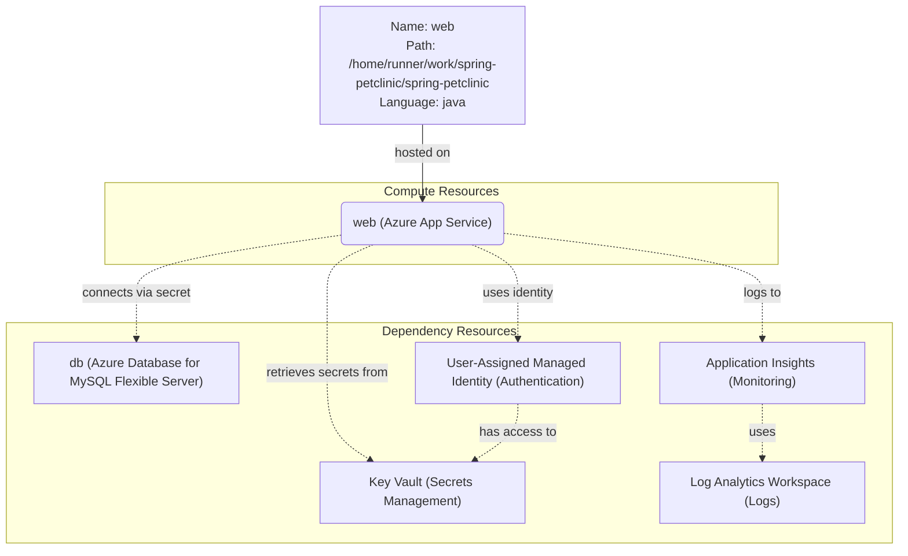

# Azure Deployment Plan for spring-petclinic Project

## **Goal**
Deploy the Spring PetClinic application to Azure using Azure Developer CLI (azd) with Bicep for infrastructure provisioning. This plan covers both infrastructure provisioning and application deployment.

**Client Info**: {"name":"github-copilot-developer","version":"1.0.0"} name: github-copilot-developer

## **Project Information**

**Spring PetClinic Application**
- **Stack**: Spring Boot 4.0.1, Java 17
- **Type**: Web application with Thymeleaf templates
- **Build Tool**: Maven
- **Containerization**: No Dockerfile present (will use Azure App Service native Java support)
- **Dependencies**: MySQL Database for persistent storage
- **Hosting**: Azure App Service (Java 17)
- **Current Database Support**: H2 (in-memory), MySQL, PostgreSQL

## **Azure Resources Architecture**

> **Install the mermaid extension in IDE to view the architecture.**

**Resource Relationships:**
- The App Service hosts the Spring PetClinic web application using Java 17 runtime
- The App Service connects to Azure Database for MySQL Flexible Server using connection string stored in Key Vault
- The User-Assigned Managed Identity is assigned to the App Service for secure access to Key Vault
- Application Insights collects telemetry and logs, backed by Log Analytics Workspace
- All secrets (database connection strings) are stored in Azure Key Vault

## **Recommended Azure Resources**

### Application: spring-petclinic (web)
- **Hosting Service Type**: Azure App Service (Linux)
- **SKU**: B2 (Basic tier, 2 cores, 3.5 GB RAM) - Suitable for development/testing workloads
- **Configuration**:
    - **Runtime**: Java 17
    - **Framework**: Spring Boot
    - **Build Tool**: Maven
    - **Port**: 8080 (default Spring Boot port)
    - **Environment Variables**:
        - `SPRING_PROFILES_ACTIVE`: mysql
        - `MYSQL_URL`: Retrieved from Key Vault
        - `MYSQL_USER`: Retrieved from Key Vault
        - `MYSQL_PASS`: Retrieved from Key Vault
        - `APPLICATIONINSIGHTS_CONNECTION_STRING`: Application Insights connection string
- **Dependencies Resource**:
    - **Dependency Name**: db (MySQL Database)
    - **SKU**: B_Standard_B1ms (Burstable tier, 1 vCore, 2 GiB RAM, 32 GiB storage) - Cost-effective for development
    - **Service Type**: Azure Database for MySQL Flexible Server
    - **MySQL Version**: 8.0
    - **Connection Type**: Secret (connection string stored in Key Vault)
    - **Environment Variables**:
        - `MYSQL_URL`: jdbc:mysql://<server-name>.mysql.database.azure.com:3306/petclinic?sslMode=REQUIRED
        - `MYSQL_USER`: petclinicadmin
        - `MYSQL_PASS`: Generated secure password

## **Recommended Supporting Services**:
- **Application Insights**: For application performance monitoring, logging, and diagnostics
- **User-Assigned Managed Identity**: For secure, password-less authentication to Azure services
- **Log Analytics Workspace**: Central repository for logs from Application Insights and App Service
- **Key Vault**: Secure storage for database connection strings and other secrets

## **Recommended Security Configurations**:
- User-Assigned Managed Identity must have "Key Vault Secrets User" role on the Key Vault
- User-Assigned Managed Identity must be assigned to the App Service
- Key Vault must use Azure RBAC for access control
- MySQL Flexible Server must enforce SSL connections
- MySQL Flexible Server should allow connections from Azure services
- App Service should use HTTPS only

## **Execution Steps**

> **Below are the steps for Copilot to follow; ask Copilot to update or execute this plan.**

### 1. Create Azure Infrastructure Files for AZD:
   - [ ] **Provisioning tool**: AZD. Expected files: azure.yaml, infra/main.bicep, infra/main.parameters.json, infra/resources.bicep, infra/app.bicep, infra/mysql.bicep
   - [ ] Get current subscription ID from Azure CLI context
   - [ ] Call tool `appmod-get-available-region-sku` to get available regions and SKUs for:
       - Microsoft.Web/sites (App Service)
       - Microsoft.DBforMySQL/flexibleServers (MySQL Flexible Server)
   - [ ] Check if expected files exist:
       - **If files exist**: Validate that Azure resources match plan requirements. Update files if needed.
       - **If files do not exist**: 
           - Call tool `appmod-get-iac-rules` with parameters: deploymentTool=azd, iacType=bicep, resourceTypes=[appservice, azuredatabaseformysql]
           - Generate missing files: azure.yaml, infra/main.bicep, infra/main.parameters.json, and module files
           - Call `get_errors` on generated Bicep files and iterate on any errors
   - [ ] Validate Bicep files with `az bicep build` and fix any errors

### 2. Environment Setup for AZD:
   - [ ] Install Azure CLI if not installed: Check with `az version`
   - [ ] Install AZD if not installed: Check with `azd version`
   - [ ] Login to Azure: `az login` (if not already logged in)
   - [ ] Create a new AZD environment: `azd env new <envName> --no-prompt` (e.g., envName: dev, prod)
   - [ ] Set required environment variables:
       - [ ] `AZURE_SUBSCRIPTION_ID`: Get from `az account show --query id -o tsv`
       - [ ] `AZURE_LOCATION`: Use recommended region from step 1 (e.g., eastus, westus2)
       - [ ] `AZURE_ENV_NAME`: Same as environment name
   - [ ] Create resource group: `az group create --name rg-<envName>-spring-petclinic --location <AZURE_LOCATION>`
   - [ ] Set AZURE_RESOURCE_GROUP: `azd env set AZURE_RESOURCE_GROUP rg-<envName>-spring-petclinic`

### 3. Deployment:
   - [ ] **Dry run infrastructure**: Run `azd provision --preview --no-prompt` to preview changes
   - [ ] **Provision infrastructure**: Run `azd provision --no-prompt` to create Azure resources
   - [ ] **Deploy application**: Run `azd deploy --no-prompt` to build and deploy the Spring PetClinic application
   - [ ] **Full deployment (alternative)**: Run `azd up --no-prompt` to provision and deploy in one step
   - [ ] If errors occur:
       - Check error messages
       - Fix Bicep files or configuration
       - Retry deployment

### 4. Deployment Validation:
   - [ ] Check application logs: Use `azd monitor --overview` or `az webapp log tail`
   - [ ] Verify application is running: Get endpoint URL with `azd env get-values | grep AZURE_APP_SERVICE_URL`
   - [ ] Test application endpoints:
       - [ ] Access homepage: `curl <app-url>`
       - [ ] Check health endpoint: `curl <app-url>/actuator/health`
   - [ ] Verify database connectivity: Check application logs for successful database connection

### 5. Summarize Result:
   - [ ] Use `appmod-summarize-result` tool to summarize the deployment result
   - [ ] Generate file: `.azure/summary.copilot.md`

## **Progress Tracking**
- Copilot must create and update `.azure/progress.copilot.md` after each major step
- Progress should include:
  - ✅ Completed tasks
  - 🔲 Pending tasks
  - ❌ Failed tasks with error notes

**Example format:**
- [x] Infrastructure files generated (azure.yaml, infra/main.bicep)
- [x] AZD environment created (dev)
- [ ] Deployment in progress
  - Attempt 1 failed: Bicep validation error. Fixed parameter type mismatch. Retrying...

## **Tools Checklist**
- Copilot MUST call the following tools as specified in the Execution Steps:
- [ ] appmod-get-available-region-sku
- [ ] appmod-get-iac-rules
- [ ] appmod-summarize-result
